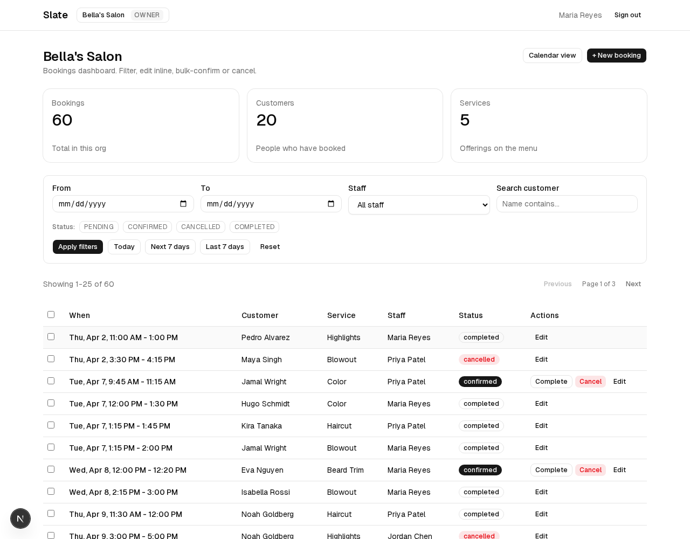
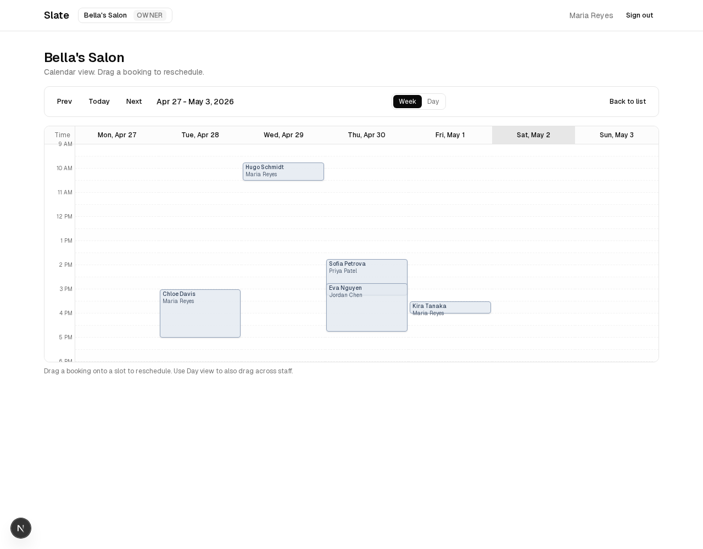
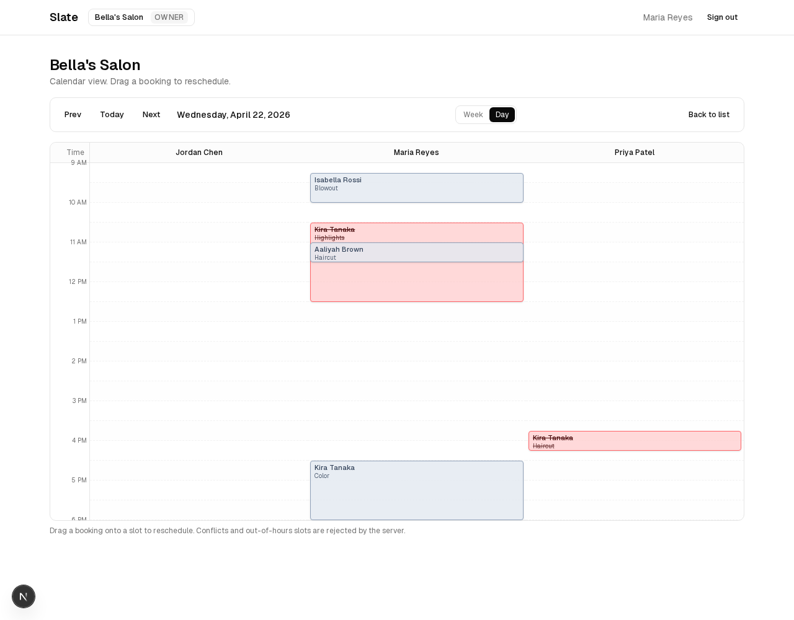
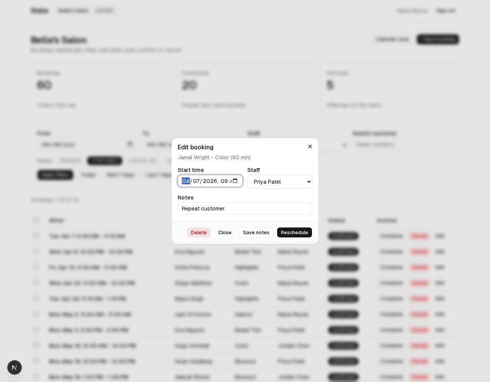
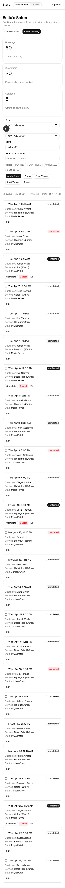
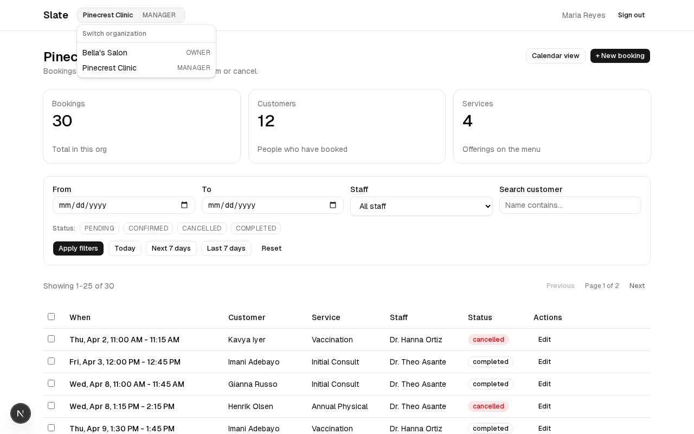
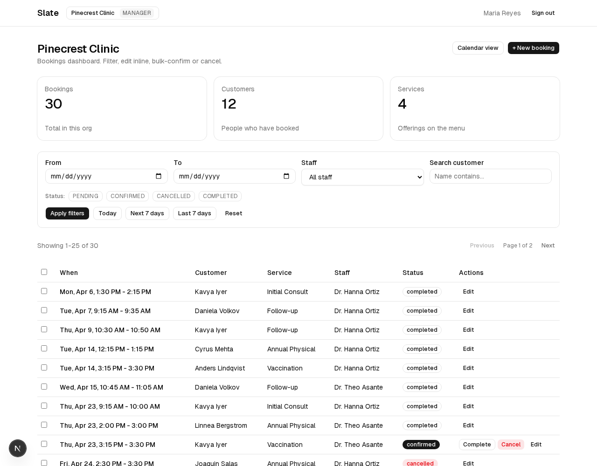
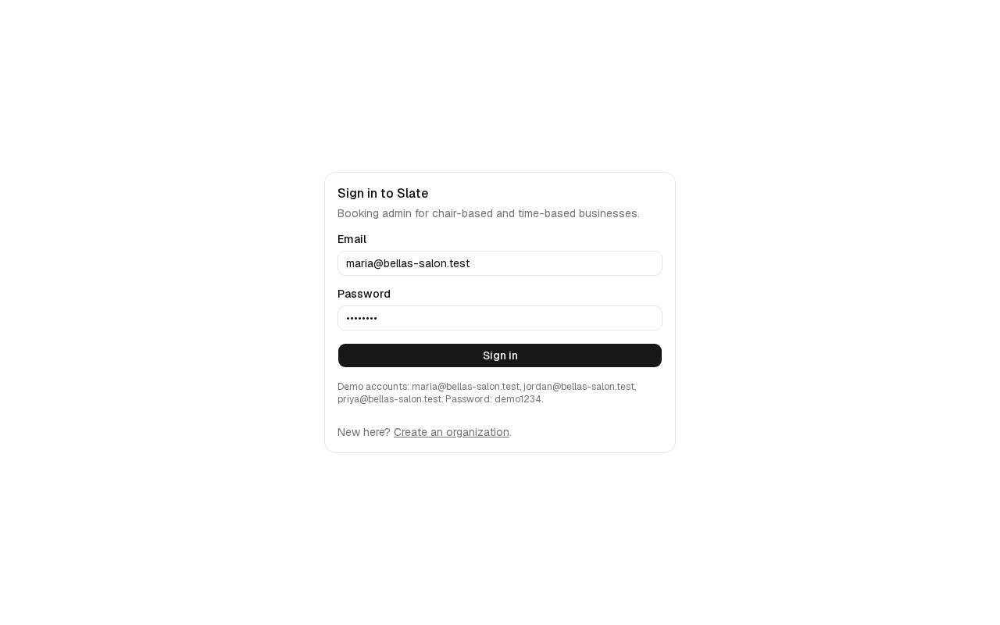
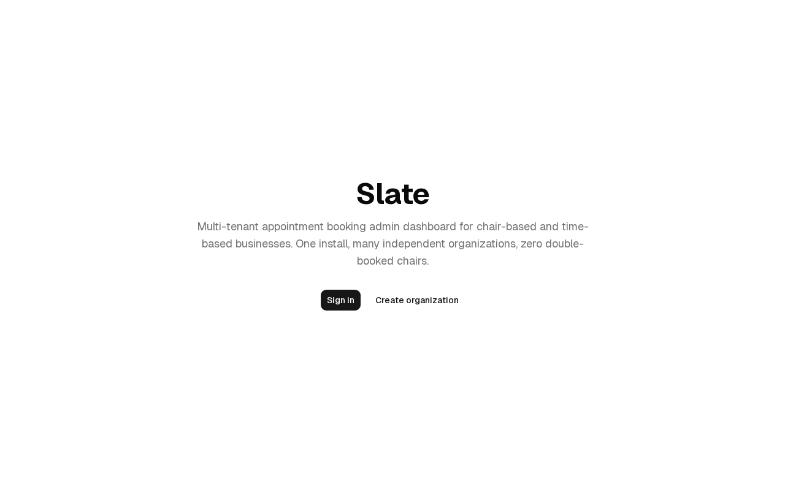

# Slate

Multi-tenant appointment booking admin dashboard. Salon-flavored seed data, generic for any chair/seat/slot business: salons, barbers, clinics, tutors, consultancies, photographers.

## What it does

Slate is the admin side of an appointment-booking SaaS. The people running the business log in, see today's bookings, filter by date or staff or status, edit bookings inline, confirm or cancel, and never double-book a chair.

Customer-facing booking comes in Phase 6. The earlier phases focus on the admin dashboard because that is where the operator spends their day.

## Features

- Multi-tenant: one Slate instance hosts many independent businesses; data is isolated per organization
- Bookings list with server-side filtering by date, status, staff, and customer search
- Inline edit, confirm, cancel, complete actions with optimistic UI
- Calendar view with week and day modes; drag to reschedule
- Per-staff availability rules (working hours, breaks)
- Conflict detection: no double-booking the same staff at the same time
- Analytics cards: daily count, 7-day outlook, top services, no-show rate, staff utilization
- Public booking page per organization slug for customers to self-book
- Mobile-responsive end to end (table collapses to cards on small screens)

## Phases

1. Multi-tenant scaffold + Auth.js + seed data (1 demo salon, 3 staff, 5 services, 20 customers, 60 sample bookings)
2. Bookings CRUD + per-staff availability rules + conflict detection
3. Admin dashboard: bookings list with filters, inline status actions, bulk actions, mobile-responsive
4. Calendar view: week view, day view with stylist columns, drag-to-reschedule
5. Analytics cards on the home page
6. Public booking page (`/book/{org-slug}`) + final mobile polish

Phase 3 is the load-bearing screen. That is where the operator lives.

## Demo data

Seed data ships as Bella's Salon: haircut, color, blowout services; staff named Maria, Jordan, Priya; 60 bookings spread across past and future. Reskin to a clinic, tutor, or consultancy by swapping the seed file.

## Screenshots

Screenshots land in `/screenshots/` as each phase ships. More appear here as the build progresses.

